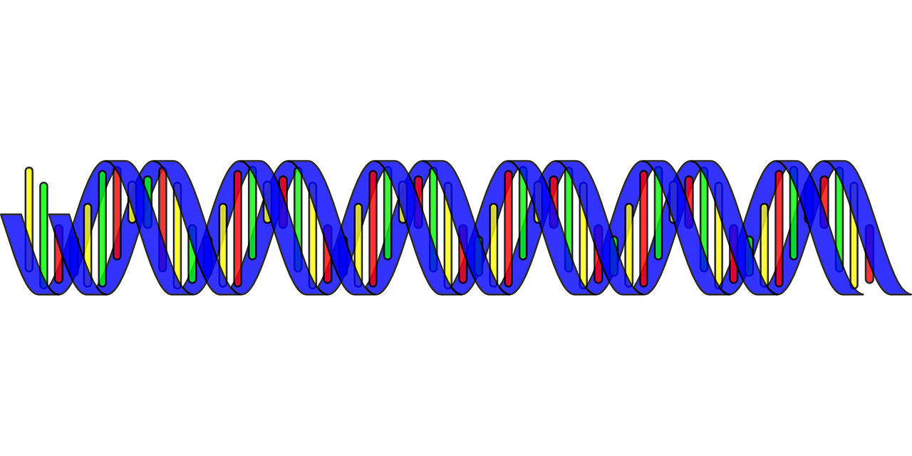

# DNA
Identify to whom a sequence of DNA belongs from a given database



Completed via DNA profiling using multiple STRs. We can compare a sequence of DNA to a given database of individuals and their STRs and determine if we have found a match or not.

For each person in the database we compare their STRs to what is found on the DNA sequence.

Example usage:
```console
$ python dna.py databases/small.csv sequences/1.txt
[['Alice', '2', '8', '3'], ['Bob', '4', '1', '5'], ['Charlie', '3', '2', '5']]
['AGATC', 'AATG', 'TATC']
AAGGTAAGTTTAGAATATAAAAGGTGAGTTAAATAGAATAGGTTAAAATTAAAGGAGATCAGATCAGATCAGATCTATCTATCTATCTATCTATCAGAAAAGAGTAAATAGTTAAAGAGTAAGATATTGAATTAATGGAAAATATTGTTGGGGAAAGGAGGGATAGAAGG

Bob
```
